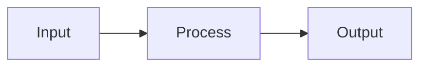

# CLAUDE.md

This file provides guidance to Claude Code (claude.ai/code) when working with code in this repository.

## Project Overview

This is a personal AI Engineering blog built with [Jekyll](https://jekyllrb.com/) and the [Chirpy](https://github.com/cotes2020/jekyll-theme-chirpy) theme. It's hosted on GitHub Pages at `https://nvbao117.github.io`. The blog covers topics in AI Engineering, LLMs, RAG, AI Agents, and deployment.

- **Theme**: jekyll-theme-chirpy (~7.3)
- **Language**: Vietnamese (vi-VN)
- **Timezone**: Asia/Ho_Chi_Minh
- **Deploy**: GitHub Pages with GitHub Actions

## Setup & Development

### Install Dependencies

```bash
bundle install
```

Installs Ruby gems defined in `Gemfile`, including Jekyll 4.4, Chirpy theme, and plugins.

### Run Local Server

```bash
# Serve published posts only
bundle exec jekyll serve

# Serve with drafts (to preview _drafts/ posts)
bundle exec jekyll serve --drafts

# Access at http://localhost:4000
```

### Build Static Site

```bash
# Generate _site/ directory (for testing)
bundle exec jekyll build

# With drafts included
bundle exec jekyll build --drafts
```

## Project Structure

```
nvbao117.github.io/
├── _config.yml                    # Jekyll config (title, url, plugins, collections)
├── _posts/                        # Published blog posts (Markdown only, name: YYYY-MM-DD-slug.md)
├── _drafts/                       # Work-in-progress posts (not included in build by default)
│   └── template.md                # Template for new posts
├── _projects/                     # Project showcases (custom collection)
├── _tabs/                         # Navigation tabs (about, archives, categories, projects, tags)
├── _data/
│   └── categories.yml             # Category metadata (optional, for icons/descriptions)
├── assets/img/posts/              # Post images organized by slug (YYYY-MM-DD-slug/)
├── scripts/
│   ├── new-post.sh                # Script to create new post with frontmatter (Bash/Linux)
│   └── new-post.ps1               # Script to create new post (Windows PowerShell)
├── _site/                         # Generated static site (Jekyll output)
├── WRITING.md                     # Detailed writing guidelines and workflow
├── TAXONOMY.md                    # Standard categories and tags used in this blog
├── Gemfile & Gemfile.lock         # Ruby dependencies
└── README.md                      # Quick setup instructions
```

## Common Development Tasks

### Create a New Blog Post

**Using the script (recommended):**

```bash
# Create and publish immediately
./scripts/new-post.sh "Your Post Title"

# Create as draft (in _drafts/, not published yet)
./scripts/new-post.sh "Your Post Title" --draft
```

The script automatically:
- Converts title with Vietnamese characters to ASCII slug (e.g., "Thử nghiệm RAG" → "thu-nghiem-rag")
- Creates the `.md` file with proper frontmatter (title, date, categories, tags)
- Creates the image directory at `assets/img/posts/<slug>/`

**Manual workflow:**

1. Copy `_drafts/template.md` to `_posts/` with name `YYYY-MM-DD-slug.md`
2. Edit frontmatter: `title`, `date`, `categories`, `tags`, `image.path`
3. Add content in Markdown
4. Create image folder: `mkdir -p assets/img/posts/YYYY-MM-DD-slug/`
5. Add images there, reference as `` (absolute paths)

### Publish a Draft Post

Move from `_drafts/` to `_posts/`:

```bash
mv _drafts/YYYY-MM-DD-slug.md _posts/YYYY-MM-DD-slug.md
git add _posts/ assets/img/posts/
git commit -m "post: Your Post Title"
git push
```

GitHub Pages redeploys automatically.

### Preview Draft Posts Locally

```bash
bundle exec jekyll serve --drafts
```

All posts in `_drafts/` will appear at `http://localhost:4000` (they won't be indexed or discoverable, just visible).

### Manage Categories & Tags

**Categories** are hierarchical (max 2 levels) and appear as top-level navigation. Tags are flat labels for filtering.

- **Add post category/tag**: Edit `categories` and `tags` in post frontmatter
- **Standardize categories**: Check `TAXONOMY.md` for approved categories
- **Add category with icon**: Add to `_data/categories.yml` with Font Awesome icon name
- **Tags**: No separate file needed; tags exist wherever used in posts. Delete by removing from all posts.

See `WRITING.md` section 9 for detailed examples.

## Key Configuration Files

### `_config.yml`

Central Jekyll config. Most important settings:

- `title`, `tagline`, `description`: Site metadata
- `url`, `baseurl`: For user site (`nvbao117.github.io`), both are set correctly
- `collections`: Defines `posts`, `tabs`, `projects` with layout and permalink rules
- `plugins`: Pagination, archives, SEO, sitemap
- `kramdown`: Markdown syntax highlighter (Rouge with line numbers on code blocks)

### Front Matter Template

Required fields for all posts:

```yaml
---
title: "Post Title"
date: 2026-04-23 10:00:00 +0700
categories: [Main Category, Sub Category]  # max 2 levels
tags: [tag1, tag2, tag3]                   # lowercase, hyphens, use existing tags
math: false                                # set to true if using LaTeX formulas
mermaid: false                             # set to true if using Mermaid diagrams
pin: false                                 # set to true to pin to homepage
image:
  path: /assets/img/posts/YYYY-MM-DD-slug/cover.png
  alt: Image description for accessibility
---
```

**Critical:** Posts without a `date` field are silently ignored by Jekyll.

## Content Features

### Math (LaTeX)

Set `math: true` in frontmatter, then use:

- Inline: `$y = wx + b$`
- Block: `$$\frac{1}{N} \sum_{i=1}^{N}(y_i - \hat{y}_i)^2$$`

### Diagrams (Mermaid)

Set `mermaid: true` in frontmatter:

````markdown

````

### Code Blocks

Specify language for syntax highlighting:

````markdown
```python
def hello():
    print("world")
```
````

### Images

Always use absolute paths starting with `/`:

```markdown

```

Store images in the post's subfolder under `assets/img/posts/`.

## Deployment

Push to `main` branch:

```bash
git add .
git commit -m "post: title or update: feature"
git push origin main
```

GitHub Actions automatically runs Jekyll build and deploys to `gh-pages` branch. Site updates within 1–2 minutes.

## Useful References

- **WRITING.md**: Detailed workflow, frontmatter spec, category/tag management, publishing checklist
- **TAXONOMY.md**: Approved categories and tags for this blog (follow to keep content organized)
- **Chirpy Theme Docs**: https://github.com/cotes2020/jekyll-theme-chirpy/wiki
- **Jekyll Documentation**: https://jekyllrb.com/docs/

## Notes on Development

- **File naming**: Post slugs must be ASCII (no Vietnamese diacritics), use dashes as word separators
- **No unpublished content**: Only files in `_posts/` are published; drafts stay in `_drafts/`
- **Image hosting**: All images live in this repo under `assets/img/posts/`, not external CDN
- **SEO**: Chirpy auto-generates sitemaps and OG tags; set image alt text for accessibility
- **Theme customization**: Avoid overriding Chirpy templates unless essential; use CSS/config instead
- **Comments**: Currently disabled in config (`comments.provider` is empty)
