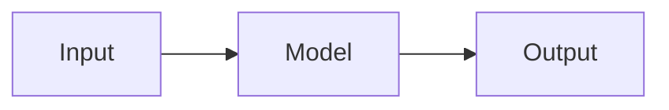

# Hướng dẫn viết blog

Tài liệu tham khảo nhanh cho workflow viết bài trên blog này.

> Xem thêm `TAXONOMY.md` để biết categories & tags chuẩn khi viết bài.

## 1. Cấu trúc thư mục

```
nvbao117.github.io/
├── _posts/                         # Bài viết đã publish (.md only)
│   └── YYYY-MM-DD-slug.md
├── _drafts/                        # Bài đang viết dở (không build)
│   ├── template.md                 # Template mẫu
│   └── YYYY-MM-DD-slug.md
├── _projects/                      # Showcase dự án
│   └── ten-du-an.md
├── _tabs/                          # Các tab trên nav
│   ├── projects.md    (order 1)
│   ├── categories.md  (order 2)
│   ├── tags.md        (order 3)
│   ├── archives.md    (order 4)
│   └── about.md       (order 5)
├── _data/
│   └── contact.yml                 # Liên hệ hiển thị ở footer
├── assets/img/posts/               # Ảnh của mỗi post
│   └── YYYY-MM-DD-slug/
│       ├── cover.png
│       └── ...
├── scripts/
│   ├── new-post.ps1                # Script tạo bài (Windows)
│   └── new-post.sh                 # Script tạo bài (Bash)
└── _config.yml                     # Cấu hình site
```

**Quy tắc vàng:**

- `_posts/` **CHỈ** chứa file `.md`, tên đúng format `YYYY-MM-DD-slug.md`
- Mọi ảnh đi theo post → `assets/img/posts/<slug-của-post>/`
- Bài chưa xong → bỏ vào `_drafts/`

## 2. Frontmatter chuẩn

```yaml
---
title: "Tiêu đề bài viết"
date: 2026-04-19 21:35:00 +0700
categories: [Chuyên mục chính, Chuyên mục phụ]   # tối đa 2 cấp
tags: [tag1, tag2, tag3]                          # nhiều tag, viết thường, dấu gạch ngang
math: false          # true nếu có công thức LaTeX
mermaid: false       # true nếu có diagram Mermaid
pin: false           # true để ghim lên đầu trang
image:
  path: /assets/img/posts/2026-04-19-slug/cover.png
  alt: Mô tả ảnh bìa
---
```

**Lưu ý quan trọng:**
- `date` là **bắt buộc** — thiếu `date` Jekyll sẽ bỏ qua bài
- Categories & tags → xem `TAXONOMY.md` để dùng cho đúng chuẩn

## 3. Workflow viết bài

### Cách 1: Dùng script (nhanh, khuyến nghị)

```powershell
# Windows (PowerShell)
.\scripts\new-post.ps1 "Tên bài viết"           # Publish luôn
.\scripts\new-post.ps1 "Tên bài viết" -Draft    # Tạo draft
```

```bash
# Git Bash / Linux
./scripts/new-post.sh "Tên bài viết"
./scripts/new-post.sh "Tên bài viết" --draft
```

Script tự động:

1. Chuyển tiêu đề có dấu → slug ASCII (`Thử nghiệm RAG` → `thu-nghiem-rag`)
2. Tạo file `.md` với frontmatter đầy đủ, ngày giờ hiện tại
3. Tạo folder ảnh `assets/img/posts/<slug>/`

### Cách 2: Copy template thủ công

```bash
cp _drafts/template.md _drafts/2026-04-19-ten-bai.md
mkdir -p assets/img/posts/2026-04-19-ten-bai
```

Sau đó sửa frontmatter và nội dung trong file mới.

## 4. Viết nội dung

### Chèn ảnh

```markdown

```

Đường dẫn phải **absolute** (bắt đầu bằng `/`).

### Code block

````markdown
```python
def hello():
    print("world")
```
````

### Công thức LaTeX

Bật `math: true` trong frontmatter, sau đó:

```markdown
Inline: $y = wx + b$

Block:
$$
\mathcal{L}(\mathbf{w}) = \frac{1}{N} \sum_{i=1}^{N} (y_i - \hat{y}_i)^2
$$
```

### Diagram Mermaid

Bật `mermaid: true` trong frontmatter, sau đó:

````markdown

````

### Blockquote / Callout

```markdown
> **Tip:** nội dung quan trọng

> **Warning:** cảnh báo
```

## 5. Preview local

```bash
# Chỉ build posts đã publish
bundle exec jekyll serve

# Build kèm drafts (để xem bài trong _drafts/)
bundle exec jekyll serve --drafts

# Truy cập: http://localhost:4000
```

## 6. Publish bài

```bash
# Khi draft đã xong, move sang _posts/
mv _drafts/YYYY-MM-DD-slug.md _posts/

# Commit và push
git add _posts/ assets/img/posts/
git commit -m "post: tên bài viết"
git push
```

GitHub Pages sẽ tự build và deploy sau 1–2 phút.

## 7. Tạo project mới

```bash
# Tạo file trong _projects/
touch _projects/ten-du-an.md
```

Nội dung file:

```yaml
---
title: Tên dự án
order: 2                    # thứ tự hiển thị (số nhỏ lên trước)
summary: Mô tả ngắn gọn 1-2 câu, hiển thị trên card.
tech: [Python, FastAPI, Docker]
repo: https://github.com/user/repo
demo: https://demo-url.com
---

## Bài toán
...

## Giải pháp
...

## Kết quả
...
```

## 8. Checklist trước khi publish

- [ ] Frontmatter đầy đủ: `title`, `date`, `categories`, `tags`
- [ ] Tên file đúng format `YYYY-MM-DD-slug.md`
- [ ] Ảnh cover nằm trong `/assets/img/posts/<slug>/cover.png`
- [ ] Mọi đường dẫn ảnh đều bắt đầu bằng `/` (absolute)
- [ ] Nếu có LaTeX → `math: true`
- [ ] Categories & tags theo `TAXONOMY.md`, không tạo tùy tiện
- [ ] Đã preview local (`bundle exec jekyll serve`), không lỗi build
- [ ] Đọc lại 1 lần, check typo

## 9. Sửa Categories & Tags

### Các file liên quan

| Việc muốn làm | Sửa file nào |
|---|---|
| Đổi category/tag của 1 post | `_posts/<tên-post>.md` — sửa frontmatter |
| Thêm category mới kèm icon | `_data/categories.yml` + dùng trong post |
| Đổi icon/description category | `_data/categories.yml` |
| Đổi tên category hàng loạt | Tất cả `_posts/*.md` đang dùng + `_data/categories.yml` |
| Thêm/sửa/xóa tag | `_posts/*.md` (tag không có file riêng) |
| Cập nhật chuẩn taxonomy | `TAXONOMY.md` (chỉ để tham khảo) |

### `_posts/*.md` — nơi gán category/tag cho post

```yaml
---
categories: [AI Engineering, RAG]    # ← sửa ở đây
tags: [rag, embeddings, vector-db]   # ← sửa ở đây
---
```

### `_data/categories.yml` — metadata cho category

Định nghĩa mô tả + icon hiển thị trên trang category. **Không bắt buộc** — category chỉ cần xuất hiện trong frontmatter post là đã chạy, file này chỉ để làm đẹp.

```yaml
- name: AI Engineering
  description: Mô tả hiển thị trên trang category
  icon: fas fa-robot           # Font Awesome icon
```

### Tags — KHÔNG có file riêng

Jekyll không có file quản lý tag. Tag tồn tại chỉ vì có post dùng nó trong frontmatter.

- **Tạo tag mới** → viết tag đó vào frontmatter của 1 post
- **Xóa tag** → xóa khỏi tất cả post đang dùng → tag tự biến mất
- **Đổi tên tag** → tìm & sửa ở tất cả post đang dùng

### Ví dụ thực tế

**Đổi category `Blog` → `Notes`:**

```bash
# 1. Mở từng post trong _posts/ có "categories: [Blog]" → đổi thành "[Notes]"
# 2. Sửa _data/categories.yml: đổi "- name: Blog" → "- name: Notes"
# 3. bundle exec jekyll build
```

**Thêm category mới `Paper Review`:**

```yaml
# Cách 1 (đơn giản): chỉ cần thêm vào post
categories: [Paper Review]
# → Jekyll tự tạo /categories/paper-review/

# Cách 2 (đẹp hơn): thêm vào _data/categories.yml
- name: Paper Review
  description: Tóm tắt và review paper AI/ML
  icon: fas fa-file-alt
```

**Đổi tên tag `llm` → `large-language-model` hàng loạt:**

```bash
# Tìm tất cả post đang dùng
grep -l "llm" _posts/*.md

# Mở từng file sửa, hoặc dùng VSCode Find & Replace in Files (Ctrl+Shift+H)
```

**Xóa tag không dùng:** chỉ cần xóa khỏi frontmatter các post đang dùng. Khi không post nào còn dùng, tag tự biến mất khỏi `/tags/`.

### Mẹo sửa nhanh nhiều file

VSCode:
1. `Ctrl + Shift + F` → Find in Files
2. Gõ text muốn tìm (ví dụ `categories: [AI, RAG]`)
3. `Ctrl + Shift + H` → Replace in Files
4. Review từng match → Replace All

## 10. Tips

- **Slug ngắn gọn** (3–5 từ), dùng dấu gạch ngang, không dấu tiếng Việt
- **Categories tối đa 2 cấp** — đừng nhồi nhiều
- **Category dùng tiếng Anh** để URL sạch (`/categories/fundamentals/` > `/categories/cơ-bản/`)
- **Tags viết thường**, dùng dấu gạch ngang (`machine-learning`, không phải `Machine Learning`)
- **Ảnh cover** nên có tỉ lệ 1200x630 (OG image chuẩn)
- **Image alt** luôn điền, tốt cho SEO + accessibility
- **Đặt `pin: true`** cho bài quan trọng muốn luôn ở đầu
- **Tái sử dụng tag đã có** thay vì tạo tag mới mỗi bài
